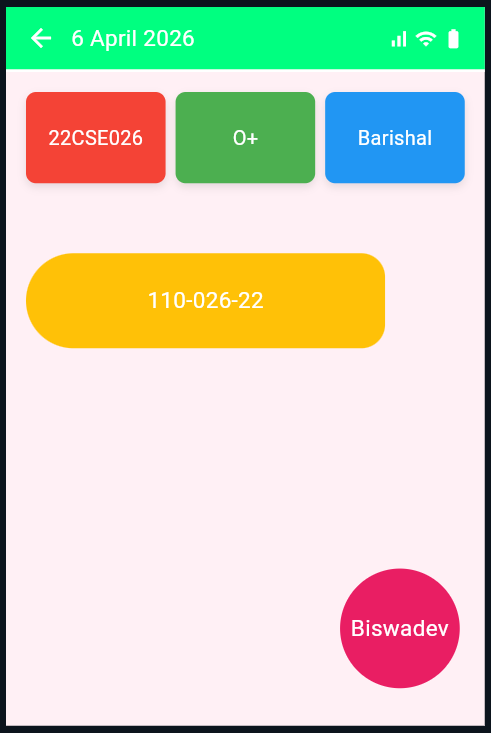

# 📱 Flutter Custom Layout App

This is my simple Flutter UI layout project  for academic submission.

## 🎯 Features
- Custom App Bar with dynamic date
- Three colored info boxes (Roll, Blood Group, District)
- Stylish registration card
- Circular nickname avatar
- Clean and responsive UI

## 🛠️ Technologies Used
- Flutter
- Dart

## 📸 Screenshot



## 📁 Project Structure

```text
my_layout_app/
├── lib/
│   └── main.dart
├── pubspec.yaml
└── README.md

## 👨‍💻 Author
**Biswadev Biswas**
